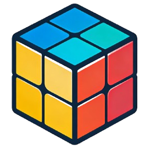
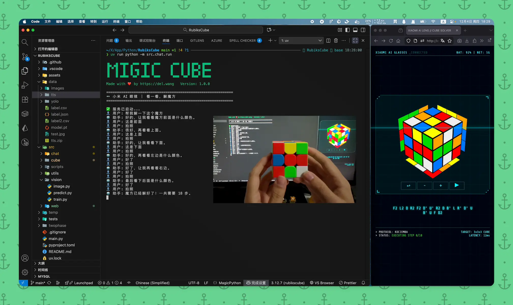

<h1 align="center">MigicCube</h1>

Solve any 3x3 Rubik's Cube in <strong>20 moves</strong> using Xiaomi AI Glasses.

[中文文档](README_CN.md) | [English Documentation](#) | [MIT LICENSE](LICENSE)

## Overview

This project uses Xiaomi AI Glasses to recognize Rubik's cubes and provides optimal solutions (within 20 moves) in under 1 second, then demonstrates each move with 3D animations, making solving Rubik's cubes easier and more fun than ever before.

## Features

- **📷 Smart Recognition**: Automatically captures photos using Xiaomi AI Glasses and recognizes cube state using YOLO11 + OpenCV.
- **⚡️ Fast Solving**: Uses Kociemba's two-phase algorithm to provide optimal solutions (within 20 moves) in under 1 second.
- **🎲 3D Visualization**: Displays realistic 3D animations on a web page, step-by-step demonstrating how to rotate each face of the cube.
- **🔊 Voice Guidance**: Supports real-time voice interaction to get operation hints for each step (Xiaomi AI Glasses have no screen).

## Technical Details

> [!IMPORTANT]
> Note: The following operations are based on ADB debugging mode, but Xiaomi AI Glasses do not enable this feature by default, so you may not be able to reproduce this project.

First, we obtain images and voice interaction records from Xiaomi AI Glasses via ADB ([related code](src/chat/adb.py)).

After obtaining the images, we use an object detection model (based on [YOLO11m](https://docs.ultralytics.com/tasks/detect)) to identify the cube position ([related code](src/vision/predict.py) | [model download](https://github.com/idootop/MigicCube/releases/tag/model)).

Then we use OpenCV for perspective transformation to correct the image and identify the color of each face's color blocks ([related code](src/vision/image.py)).

Next, we use the [Kociemba](https://github.com/hkociemba/RubiksCube-TwophaseSolver) two-phase solving algorithm to provide optimal solutions within 20 moves in under 1 second ([related code](src/cube/kociemba.py) | [pruning table download](https://github.com/idootop/MigicCube/releases/tag/kociemba)).

Finally, we synchronize the solution to the web interface and use [Roofpig](https://github.com/larspetrus/Roofpig) to display 3D cube animations ([related code](src/web/index.html)).

## Update History

- [x] Support operators: U(u), D(d), F(f), B(b), L(l), R(r), M, E, S, x, y, z and counterclockwise('), repeat operations (U2'), etc.
- [x] Complete cube initialization, operator mapping, and state observation interfaces
- [x] Web interface supports previewing cube operation sequence results and replaying solution steps
- [x] Implement complete CFOP 3x3 Rubik's cube speed-solving algorithm (based on [PyCube-Solver](https://github.com/saiakarsh193/PyCube-Solver))
- [x] Use Kociemba method to solve cubes (compressed to within 20 moves)
- [x] Implement Xiaomi AI Glasses text conversation real-time monitoring and photo capture POC
- [x] Implement YOLO11 cube recognition model data collection, processing, training, and inference pipeline
- [x] Implement cube state extraction from visual (image/camera) input and automatic solution generation
- [x] Optimize interaction flow (support voice interaction, photo button, and volume up/down event monitoring)
- [x] Support real-time preview of cube state and previous/next/reset operations
- [x] Implement TTS voice prompts and voice interaction flow

## License

MIT License © 2025-PRESENT [Del Wang](https://del.wang)
